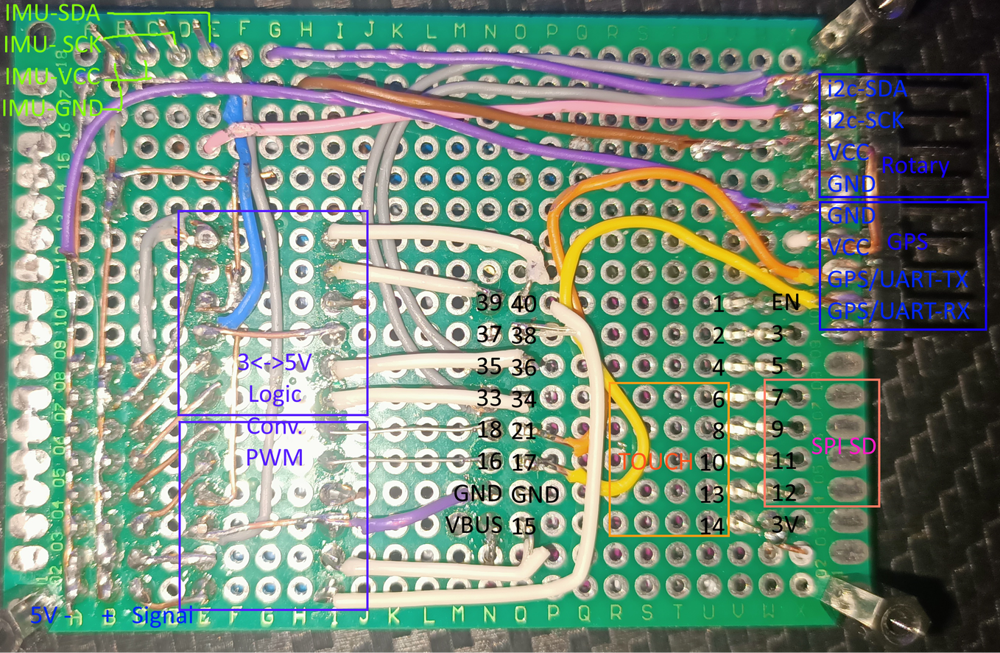

# ESPilot

# Pinout

|  39 | 40 | 1 | EN |
| --- | --- | --- | --- |
| 37 | 38 | 2 | 3 |
| 35 - I2C SCL | 36 | 4 | 5 |
| 33 - I2C SDA | 34 | 6 - Touch DOWN jaune | 7 - SPI SCK SD |
| 18 - 10k 3V3 | 21 - UART TX GPS (vert/orange) | 8 - Touch RIGHT - vert | 9 - SPI MISO SD |
| 16 | 17 - UART RX GPS (jaune) | 10 - Touch OK - bleu | 11 - SPI MOSI SD |
| GND - RC IN - | GND - General GND | 13 - Touch UP - violet | 12 - SPI SS SD |
| VBUS - RC IN + | 15 | 14 - Touch LEFT - gr-145is | 3V3 - General 3v |

[SPI Reader EN.pdf](ESPilot%200eab2317a6d64794b9eaa18b996d0e03/SPI_Reader_EN.pdf)

[AS5600_DS000365_5-00.pdf](ESPilot%200eab2317a6d64794b9eaa18b996d0e03/AS5600_DS000365_5-00.pdf)

[sch_s2_mini_v1.0.0.pdf](ESPilot%200eab2317a6d64794b9eaa18b996d0e03/sch_s2_mini_v1.0.0.pdf)

# I2C Addresses

0x30 LCD 12832

0x28 bno055 - IMU

0x36 AS5600 - Magnetic rotary position sensor

# SERVO

SG90 9G: 

| SERVO | Min | Max |
| --- | --- | --- |
| SG90 9G Mini | 200 | 1350 |
|  | 200 | 1250 |

[Notes:](https://www.notion.so/Notes-3c6d64b2f6c34ba1a9c0f9aa6163afb0)